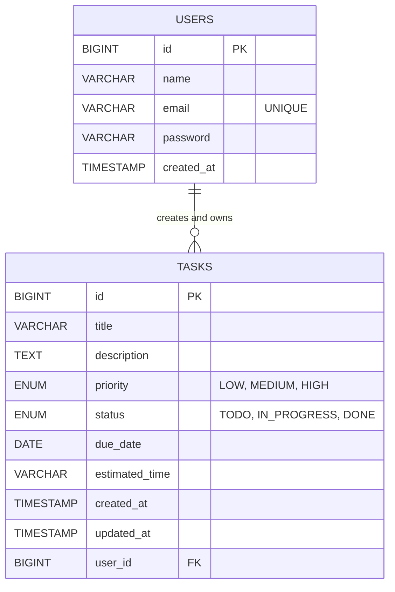

# Entity-Relationship (ER) Diagram

This document describes the ER diagram for the AI-Powered Task Management Portal.

## Mermaid Diagram

## Description
- **USERS**: Represents individuals registered on the platform. Each user has a unique ID, an email, an encrypted password, and a name.
- **TASKS**: Represents the actionable items created by users. Each task contains a title, detailed description, priority level, current status, due date, and estimated completion time (often generated by the AI).
- **Relationship**: The relationship is **One-to-Many**. A single user can have multiple tasks, but each task belongs to exactly one user. If a user is deleted, their tasks are cascaded and deleted as well.
