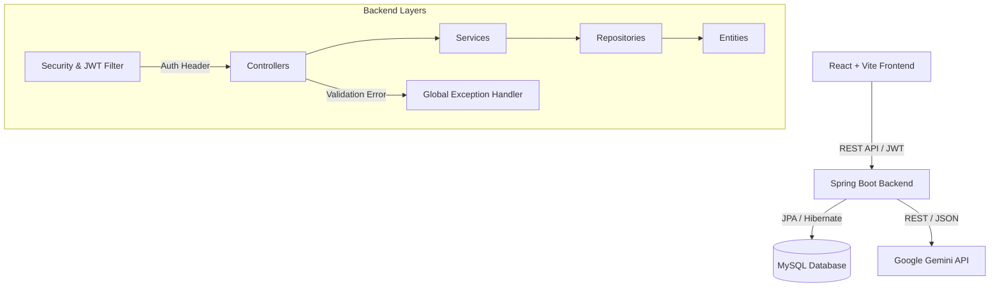

# AI-Powered Task Management Portal

A full-stack, production-ready SaaS Task Management application featuring an AI-Powered Task Assistant (Google Gemini) built with Spring Boot (Backend) and React.js (Frontend).

## 🚀 Project Overview

This portal helps users manage their daily tasks efficiently. By simply typing a short title for a task, the integrated **AI Assistant** automatically analyzes the title to generate a comprehensive description, assign a priority level, and suggest an estimated completion time, saving users from manual data entry. 

**Key Features:**
- **Authentication:** JWT-based stateless authentication (Login/Register).
- **Task Management:** Full CRUD operations with server-side pagination, searching, and filtering.
- **AI Integration:** Google Gemini AI auto-completion for task details.
- **Dashboard:** Interactive statistics and charts using Recharts.
- **UI/UX:** Modern SaaS design, glassmorphism, responsive layout, and Dark Mode.
- **API Documentation:** Auto-generated Swagger/OpenAPI docs.

---

## 🏗 Architecture Diagram



---

## 💾 Database Schema

The database relies on two primary entities in a **One-to-Many** relationship (One User can have Many Tasks).

### `users` Table
| Column | Type | Constraints |
|--------|------|-------------|
| `id` | BIGINT | PRIMARY KEY, AUTO_INCREMENT |
| `name` | VARCHAR | NOT NULL |
| `email` | VARCHAR | NOT NULL, UNIQUE |
| `password` | VARCHAR | NOT NULL (BCrypt hashed) |
| `created_at` | TIMESTAMP | DEFAULT CURRENT_TIMESTAMP |

### `tasks` Table
| Column | Type | Constraints |
|--------|------|-------------|
| `id` | BIGINT | PRIMARY KEY, AUTO_INCREMENT |
| `title` | VARCHAR | NOT NULL |
| `description` | TEXT | |
| `priority` | ENUM | LOW, MEDIUM, HIGH |
| `status` | ENUM | TODO, IN_PROGRESS, DONE |
| `due_date` | DATE | |
| `estimated_time` | VARCHAR | |
| `created_at` | TIMESTAMP | DEFAULT CURRENT_TIMESTAMP |
| `updated_at` | TIMESTAMP | ON UPDATE CURRENT_TIMESTAMP |
| `user_id` | BIGINT | FOREIGN KEY (`users.id`) |

---

## 🌐 API Endpoints

Once the backend is running, you can view the full interactive Swagger documentation at:  
👉 `http://localhost:8080/swagger-ui.html`

### Authentication (`/api/auth`)
- `POST /register`: Register a new user (Requires `name`, `email`, `password`). Returns JWT.
- `POST /login`: Authenticate user (Requires `email`, `password`). Returns JWT.

### Tasks (`/api/tasks`) - *Requires Bearer Token*
- `GET /`: Retrieve paginated tasks. Supports `?status=`, `?priority=`, `?search=`, `?page=`, `?size=`.
- `GET /stats`: Retrieve counts for dashboard metrics.
- `POST /`: Create a new task.
- `PUT /{id}`: Update an existing task.
- `DELETE /{id}`: Delete a task.

### AI Assistant (`/api/ai`) - *Requires Bearer Token*
- `POST /generate`: Pass `{"title": "..."}`. Returns AI generated `description`, `priority`, and `estimatedTime`.

---

## 🤖 AI Workflow

1. The user opens the **"New Task"** modal on the Frontend.
2. The user types a short task title (e.g., *"Prepare Q3 Financial Review"*).
3. The user clicks **"AI Auto-fill"**.
4. The React app sends a POST request to `/api/ai/generate` with the title.
5. The Spring Boot `AiService` formats a strict prompt and calls the Google Gemini REST API.
6. Gemini analyzes the title and returns a JSON payload containing a detailed description, suggested priority, and estimated hours.
7. The Spring Boot backend parses, cleans, and forwards the response back to the client.
8. The Frontend automatically populates the form fields, allowing the user to review and instantly save the task.

---

## 💻 Setup Instructions (Local)

### Prerequisites
- JDK 17
- Node.js 18+
- MySQL Server
- Google Gemini API Key

### Backend Setup
1. Create a MySQL database named `task_management`.
2. Navigate to `/backend/src/main/resources/application.properties` and add your MySQL credentials and Gemini API Key:
   ```properties
   gemini.api.key=YOUR_ACTUAL_API_KEY
   ```
3. Run the application:
   ```bash
   cd backend
   ./mvnw spring-boot:run
   ```

### Frontend Setup
1. Open a new terminal.
2. Install dependencies and start the Vite dev server:
   ```bash
   cd frontend
   npm install
   npm run dev
   ```
3. Visit `http://localhost:5173`.

---

## 🐳 Setup Instructions (Docker)

To run the entire stack (MySQL, Backend, Frontend) using Docker:

1. Add your Gemini API key to the `docker-compose.yml` environment variables.
2. Run the compose cluster:
   ```bash
   docker-compose up -d --build
   ```
3. The frontend will be available at `http://localhost:5173` and the backend at `http://localhost:8080`.

---

## 🚀 Deployment Guide

### Deploying the Backend to Render
1. Create a new **Web Service** on Render and connect your Git repository.
2. Ensure the environment is set to **Docker** (Render will use the `/backend/Dockerfile`).
3. Set the **Root Directory** to `backend`.
4. Add the following Environment Variables in the Render dashboard:
   - `SPRING_DATASOURCE_URL` (Your managed MySQL URL)
   - `SPRING_DATASOURCE_USERNAME`
   - `SPRING_DATASOURCE_PASSWORD`
   - `GEMINI_API_KEY`
   - `JWT_SECRET` (A secure random string)
5. Deploy.

### Deploying the Frontend to Vercel
1. Create a new Project on Vercel and import your repository.
2. Set the **Root Directory** to `frontend`.
3. Vercel will automatically detect Vite. 
4. Add an Environment Variable:
   - `VITE_API_BASE_URL` = `https://your-render-backend-url.onrender.com/api`
5. Deploy. (The included `vercel.json` ensures React Router handles page refreshes correctly without 404 errors).

---
*Built with ❤️ utilizing Spring Boot & React.*
