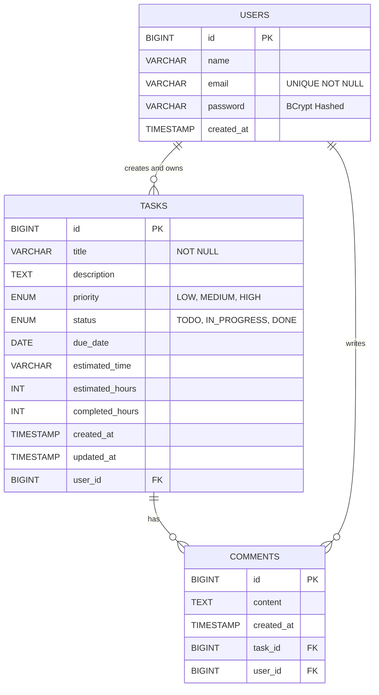

# NeuraFlow — AI-Powered Task Management Portal

> **An intelligent, full-stack productivity platform powered by Google Gemini AI.**  
> Built with React.js + Spring Boot + MySQL.

---

## 🚀 Live Demo

| Resource | Link |
|---|---|
| 📦 GitHub Repository | [SakshiGhanekar/AI--Productivity--Manager](https://github.com/SakshiGhanekar/AI--Productivity--Manager) |
| 🌐 Live App (Vercel) | _Coming soon after deployment_ |

---

## 📋 Table of Contents

- [Project Overview](#-project-overview)
- [Features](#-features)
- [Tech Stack](#-tech-stack)
- [Architecture](#-architecture)
- [ER Diagram](#-er-diagram)
- [AI Workflow](#-ai-workflow)
- [Folder Structure](#-folder-structure)
- [Getting Started](#-getting-started)
- [Security](#-security)
- [Assignment Document](#-assignment-document)

---

## 🧠 Project Overview

The **NeuraFlow AI Task Management Portal** is a comprehensive, production-ready full-stack application designed to streamline personal productivity. It allows users to:

- Register & log in securely with JWT authentication
- Manage tasks on a beautiful Kanban board
- Use **Google Gemini AI** to auto-generate task descriptions, priorities, and time estimates from just a task title
- Track task progress with real-time countdowns
- Visualize analytics and productivity stats

---

## ✨ Features

| Feature | Description |
|---|---|
| 🔐 **Secure Auth** | JWT-based stateless login & registration with BCrypt password hashing |
| 🤖 **AI Auto-fill** | Gemini AI generates description, priority & time estimate from task title |
| 📋 **Kanban Board** | Drag-and-drop style columns: To Do → In Progress → Done |
| ⏱️ **Live Countdown** | Real-time countdown timers per task with color-coded progress bars |
| 📊 **Analytics** | Dashboard with task completion stats, priority breakdown |
| 🌙 **Dark / Light Mode** | Fully themed dark and light mode |
| 📱 **Responsive Design** | Works on desktop, tablet and mobile |
| 💎 **Premium UI** | Glassmorphism, gradient animations, micro-interactions |
| 🎬 **Splash + Onboarding** | Animated NeuraFlow splash screen with onboarding welcome flow |

---

## 🛠️ Tech Stack

### Frontend
| Technology | Purpose |
|---|---|
| React.js 18 | Component-based UI framework |
| Vite | Ultra-fast build tool & dev server |
| Tailwind CSS | Utility-first CSS framework |
| Framer Motion | Smooth animations & transitions |
| React Router DOM | Client-side routing |
| Axios | HTTP client with JWT interceptors |
| Lucide React | Icon library |
| date-fns | Date formatting utilities |

### Backend
| Technology | Purpose |
|---|---|
| Spring Boot 3 | Java REST API framework |
| Spring Security + JWT | Stateless authentication |
| Spring Data JPA / Hibernate | ORM for database interaction |
| MySQL 8 | Relational database |
| Google Gemini AI (REST) | AI task generation |
| Jackson ObjectMapper | JSON serialization / deserialization |
| Maven | Dependency management |

---

## 🏗️ Architecture

```
┌─────────────────────────────────────────────────────────┐
│                     CLIENT (React SPA)                   │
│  ┌──────────┐  ┌──────────┐  ┌───────────┐  ┌────────┐ │
│  │ AuthCtx  │  │ TaskCtx  │  │  Pages    │  │  UI    │ │
│  └──────────┘  └──────────┘  └───────────┘  └────────┘ │
│                   Axios (JWT Interceptors)               │
└──────────────────────────┬──────────────────────────────┘
                           │ HTTPS / REST
┌──────────────────────────▼──────────────────────────────┐
│                   BACKEND (Spring Boot)                  │
│  ┌────────────┐  ┌────────────┐  ┌───────────────────┐  │
│  │ Controller │→ │  Service   │→ │   Repository      │  │
│  └────────────┘  └────────────┘  └─────────┬─────────┘  │
│  ┌────────────┐  ┌────────────┐            │            │
│  │ JWT Filter │  │  AiService │            │ JPA        │
│  └────────────┘  └────────────┘            │            │
└──────────────────────────┬─────────────────┼────────────┘
                           │ REST            │ SQL
               ┌───────────▼───┐      ┌──────▼──────┐
               │  Google Gemini│      │   MySQL DB  │
               │     AI API    │      │             │
               └───────────────┘      └─────────────┘
```

**Flow:**
- Frontend sends requests with `Bearer <JWT>` token
- Spring Security's `JwtAuthFilter` validates the token on every request
- Controller → Service → Repository follows strict layered architecture
- `AiService` calls Google Gemini REST API and returns structured JSON

---

## 🗄️ ER Diagram



### Relationship Descriptions

| Relationship | Type | Description |
|---|---|---|
| `USERS → TASKS` | One-to-Many | A user can create many tasks; each task belongs to exactly one user. CASCADE DELETE applies. |
| `TASKS → COMMENTS` | One-to-Many | A task can have many comments for collaboration. |
| `USERS → COMMENTS` | One-to-Many | A user can write comments on any task they own. |

---

## 🤖 AI Workflow

```
User types task title
        │
        ▼
POST /api/ai/generate  { title: "..." }
        │
        ▼
AiService builds Gemini prompt
        │
  ┌─────▼──────┐
  │ Gemini API │  →  Raw JSON string response
  └─────┬──────┘
        │
        ▼
Strip markdown (```json ... ```)
        │
        ▼
Jackson ObjectMapper.readValue()
        │
        ▼
AiGenerateResponse { description, priority, estimatedTime, estimatedHours }
        │
        ▼
Smart Fallback (if API fails):
 - Detects keywords: "bug/fix" → HIGH priority
 - Detects "database/api" → backend checklist
 - Detects "design/ui" → frontend checklist
 - Detects "test/docs" → QA checklist
        │
        ▼
Frontend fills form automatically ✅
```

---

## 📁 Folder Structure

```
AI-Powered Task Management Portal/
├── frontend/                    # React + Vite SPA
│   ├── src/
│   │   ├── components/          # Reusable UI components
│   │   │   ├── KanbanBoard.jsx  # Kanban columns & cards
│   │   │   ├── TaskFormModal.jsx # Create/Edit task modal
│   │   │   ├── TaskCountdown.jsx # Live countdown timers
│   │   │   └── Layout.jsx       # App shell & sidebar
│   │   ├── pages/               # Route-level page components
│   │   │   ├── Splash.jsx       # Animated NeuraFlow splash screen
│   │   │   ├── Welcome.jsx      # Onboarding welcome screen
│   │   │   ├── Login.jsx        # Sign in page
│   │   │   ├── Register.jsx     # Registration page
│   │   │   ├── Dashboard.jsx    # Stats overview
│   │   │   ├── TaskList.jsx     # Full task management
│   │   │   ├── AiAssistant.jsx  # AI chat assistant
│   │   │   ├── Analytics.jsx    # Charts & analytics
│   │   │   └── Settings.jsx     # User settings
│   │   ├── context/
│   │   │   ├── AuthContext.jsx  # JWT auth state
│   │   │   └── TaskContext.jsx  # Task CRUD state
│   │   └── api.js               # Axios instance + interceptors
│   ├── public/
│   ├── index.html
│   └── package.json
│
├── backend/                     # Spring Boot REST API
│   └── src/main/java/com/taskmanagement/backend/
│       ├── controller/          # REST endpoints
│       ├── service/             # Business logic + AiService
│       ├── repository/          # JPA repositories
│       ├── entity/              # JPA entities (User, Task)
│       ├── dto/                 # Data Transfer Objects
│       ├── security/            # JWT filter, SecurityConfig
│       └── config/              # CORS, AppConfig
│
├── docker-compose.yml           # Docker multi-service setup
├── schema.sql                   # Database schema
├── ER_Diagram.md
└── Assignment_Document.md
```

---

## 🚦 Getting Started

### Prerequisites
- Node.js 18+
- Java 17+
- MySQL 8+

### Frontend Setup

```bash
cd frontend
npm install
npm run dev
# App runs on http://localhost:5173
```

### Backend Setup

```bash
cd backend

# Set environment variables in application.properties:
# spring.datasource.url=jdbc:mysql://localhost:3306/taskdb
# spring.datasource.username=root
# spring.datasource.password=yourpassword
# gemini.api.key=YOUR_GEMINI_API_KEY

./mvnw spring-boot:run
# API runs on http://localhost:8080
```

### Docker (Full Stack)

```bash
docker-compose up --build
```

---

## 🔐 Security

| Feature | Implementation |
|---|---|
| Password Storage | BCrypt (never stored plaintext) |
| Authentication | Stateless JWT Bearer tokens |
| Route Protection | Spring Security filter chain |
| CORS | Configured for frontend origin only |
| Error Handling | `@ControllerAdvice` — no stack traces exposed |
| Input Validation | Jakarta Bean Validation on all DTOs |

---

## 📄 Assignment Document

### 1. Project Overview
The NeuraFlow AI Task Management Portal is a comprehensive full-stack application that integrates Google Gemini AI to generate task metadata (descriptions, priorities, estimates) from plain-English titles.

### 2. Assumptions Made
- **Single-tenant**: Each user manages their own private tasks.
- **AI Availability**: A valid `GEMINI_API_KEY` is available. A smart keyword-based fallback handles failures.
- **Database**: MySQL 8.0+ dialect.

### 3. Challenges Faced

| Challenge | Solution |
|---|---|
| AI response formatting (markdown injection) | Custom regex sanitization before `ObjectMapper.readValue()` |
| JWT expiry & refresh | Token stored in `localStorage`; Axios interceptor attaches it to every request |
| Countdown NaN bug | Added `isNaN()` guard; component returns `null` gracefully when date is invalid |
| Real-time countdown | `setInterval` every 60s using `createdAt + estimatedHours` as the time budget |
| UI state sync | Optimistic updates in Context API to avoid full re-fetches |

### 4. Future Enhancements
- 🔔 Push notifications for overdue tasks (WebSockets / SendGrid)
- 👥 Collaborative workspaces with team task assignment
- 🖱️ True drag-and-drop Kanban with `@dnd-kit`
- 🔑 OAuth2 Sign-in (Google / GitHub)
- 📱 React Native mobile app

### 5. Conclusion
This project demonstrates end-to-end engineering proficiency: secure API design, relational database modeling, modern React architecture, and AI integration — all polished with a premium, production-ready UI/UX.

---

## 👩‍💻 Author

**Sakshi Ghanekar**  
GitHub: [@SakshiGhanekar](https://github.com/SakshiGhanekar)

---

> ⭐ If you found this project useful, please give it a star on GitHub!
